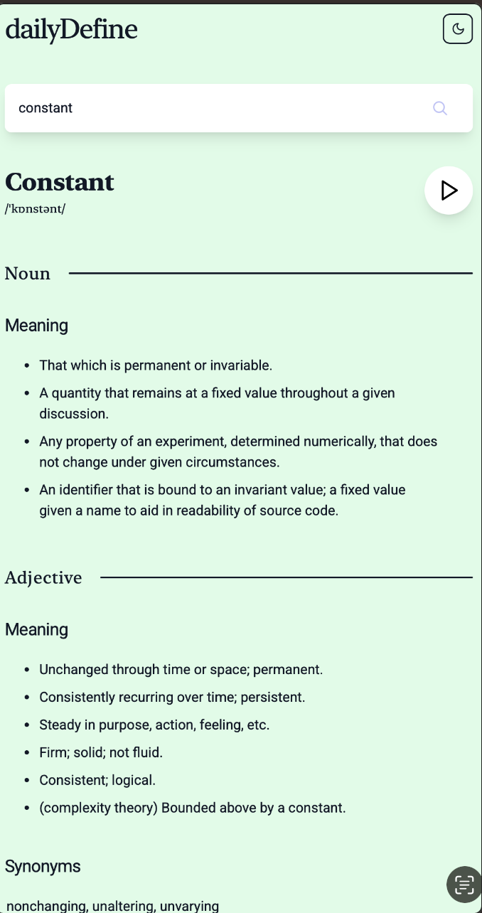
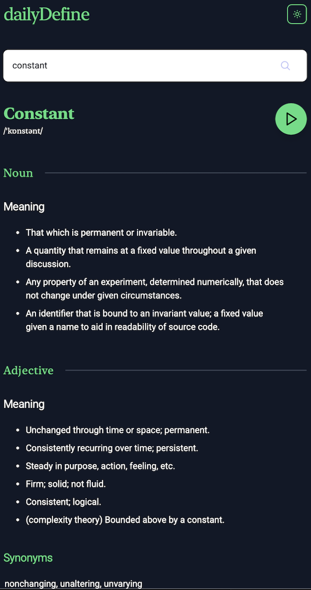

# DailyDefine

**DailyDefine** is a lightweight, user-friendly dictionary app that enables users to search for English words and view their definitions, parts of speech, phonetics, and example usage. The application uses a free dictionary API to fetch word data in real time and includes features like light/dark theme toggling to enhance the user experience.

---

## Features

- **Word Search**: Search for any English word and fetch detailed meanings.
- **Phonetics Support**: Provides phonetics with audio examples (if available).
- **Part of Speech Display**: Displays different parts of speech for the word (e.g., noun, verb, exclamation).
- **Example Sentences**: Showcases example sentences for better understanding.
- **Dynamic Theme Toggle**: Switch between light and dark mode seamlessly.
- **Error Handling**: User-friendly messages for invalid words or empty searches.
- **Responsive Design**: Fully responsive and compatible with different screen sizes.

---

## Tech Stack

### **Frontend**
- [React](https://reactjs.org/) 
- [TailwindCSS](https://tailwindcss.com/) 
- [Vite](https://vitejs.dev/) 

### **API**
- [Dictionary API](https://dictionaryapi.dev/) 

---

## Project Structure


```bash
DailyDefine
├── public/                 # Static assets
├── src/
│   ├── assets/             # Local app assets (e.g., images, icons)
│   ├── components/         # Reusable UI components
│   │   ├── Content.jsx     # Renders meanings and definitions
│   │   ├── Heading.jsx     # Renders a heading with phonetics and word details
│   │   └── ui/
│   │       └── ThemeToggle.jsx # Contains theme toggle logic
│   ├── services/           # API handling logic (optional refactor)
│   ├── App.jsx             # Main entry point of the application
│   ├── index.css           # Global app styles
│   └── main.jsx            # App bootstrap point
├── package.json            # Project dependencies and setup
└── README.md               # Documentation
```


---

## Installation

Follow these steps to set up the project on your local machine:

### Prerequisites
Ensure you have the following tools installed:
- [Node.js](https://nodejs.org/) (version 16 or higher)
- [npm](https://www.npmjs.com/) (Node package manager, comes with Node.js)
- IDE [Webstorm](https://www.jetbrains.com/webstorm/)

---

### Local Development
1. **Clone the Repository**
   ```bash
   git clone https://github.com/your-username/daily-define.git
   cd daily-define
   ```

2. **Install Dependencies**
   Install the required packages using npm:
   ```bash
   npm install
   ```

3. **Run the Application**
   Start the development server:
   ```bash
   npm run dev
   ```

4. **Visit the App**
   Open your browser and visit:
   ```
   http://localhost:5173
   ```

---

## Usage

1. Enter any English word into the search bar.
2. Click the **Search Button** or press **Enter** to fetch the word data.
3. View the word's:
    - Phonetics and audio pronunciation.
    - Definitions by part of speech.
    - Example sentences for better context.
4. Use the **Theme Toggle** to switch between light and dark modes.

---

## API Reference

This application fetches data from the [Dictionary API](https://dictionaryapi.dev/). Below is an example of the data structure returned by the API for the word `hello`:

```json
{
  "word": "hello",
  "phonetics": [
    {
      "text": "həˈləʊ",
      "audio": "//ssl.gstatic.com/dictionary/static/sounds/20200429/hello--_gb_1.mp3"
    }
  ],
  "meanings": [
    {
      "partOfSpeech": "exclamation",
      "definitions": [
        {
          "definition": "used as a greeting or to begin a phone conversation.",
          "example": "hello there, Katie!",
          "synonyms": [],
          "antonyms": []
        }
      ]
    }
  ]
}
```

---

## Environment Variables (Optional)

No API keys are necessary for this app, as the Dictionary API is publicly available. However, you can refactor the API endpoint into an environment variable for better manageability.

1. Create a `.env` file in the root directory.
2. Add the following:
   ```env
   VITE_API_URL=https://api.dictionaryapi.dev/api/v2/entries/en/
   ```

3. Update the API call in `App.jsx`:
   ```javascript
   const response = await fetch(`${import.meta.env.VITE_API_URL}${word}`);
   ```

---

## Available Scripts

In the project directory, you can run:

- **`npm run dev`**: Starts the development server.
- **`npm run build`**: Builds the app for production.
- **`npm run preview`**: Previews the production build.
- **`npm install`**: Installs all project dependencies.
- **`npm run lint`**: Lints the codebase to find and fix code quality issues (if ESLint is configured).

---

## Contribution Guidelines

Contributions are welcome! Follow these steps to contribute:

1. **Fork the Repository**: Click "Fork" on the project GitHub page.
2. **Clone the Fork**:
   ```bash
   git clone https://github.com/your-username/daily-define.git
   cd daily-define
   ```
3. **Create a Branch**:
   ```bash
   git checkout -b feature/new-feature
   ```
4. **Make Your Changes**: Make changes in your local environment.
5. **Push Changes**:
   ```bash
   git push origin feature/new-feature
   ```
6. **Submit a Pull Request**: Create a pull request on the main repository.

---

## Future Improvements

- **Offline Support:** Save recently searched words to local storage for offline access.
- **Save Favorites:** Allow users to save favorite words and revisit them later.
- **Multiple Language Support:** Add the ability to search for words in different languages.
- **Improved Error Feedback:** Add detailed error feedback for better user experience (e.g., API rate limits, internet connectivity).

---

## License

This project is licensed under the [MIT License](LICENSE). Feel free to use, modify, and distribute it as per the terms of the license.

---

## Acknowledgments

- [Free Dictionary API](https://dictionaryapi.dev/) for making this project possible.
- [React](https://reactjs.org/) and [TailwindCSS](https://tailwindcss.com/) for simplifying UI and development.
- Open-source assets and resources for enhancing the application's design and functionality.

---

## Screenshots

### **Landing Page & Search Result | Light Mode**


### **Landing Page & Search Result | Dark Mode**


---
